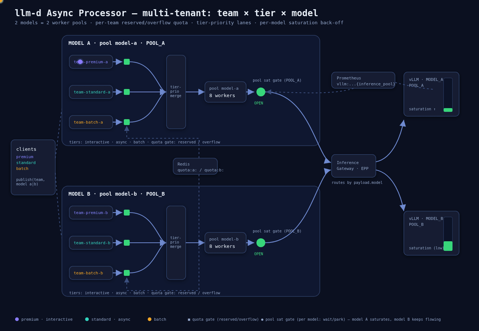

# Multi-Tenant Async Processing — Quota, Priority & Saturation

An advanced [Async Processor](https://github.com/llm-d/llm-d-async) scenario built on the
[asynchronous-processing](../README.md) guide, across three dimensions — **team × tier × model**. Each
**team** gets a per-team quota (reserved vs. overflow) and a priority **tier**; each **model** gets its
own worker pool with independent **saturation-aware back-off**, observed through self-hosted
Prometheus + Grafana (or GCP Cloud Monitoring on the Pub/Sub backend).

The scenario is the point; the **message queue is a pluggable backend** — it runs unchanged on **Redis
SortedSet** (the default here) or **GCP Pub/Sub**. The gate configuration, worker pools, and scenario
walkthroughs are identical across both; only the queue wiring and how you publish differ.



> [!NOTE]
> Source + regeneration for the diagram: [`diagram/`](diagram/) (`architecture.html` is the editable
> animated SVG).

## Overview

The demo runs **two models**, each served by its own `InferencePool` behind one gateway. Each model
gets its **own worker pool** (`model-a`, `model-b`) — so concurrency and saturation are isolated per
model — and within each pool three teams contend by **tier** and **quota**. That's **6 queues**
(3 teams × 2 models) → **2 pools**:

| Model → pool | Team | Queue (Redis) | Tier | Reserved quota | Quota prefix |
| :-- | :-- | :-- | :-- | :-- | :-- |
| **`model-a`** | premium | `team-premium-a` | `interactive` | concurrency **2** | `quota:a:` |
| | standard | `team-standard-a` | `async` | concurrency **2** | `quota:a:` |
| | batch | `team-batch-a` | `batch` | concurrency **1** | `quota:a:` |
| **`model-b`** | premium | `team-premium-b` | `interactive` | concurrency **2** | `quota:b:` |
| | standard | `team-standard-b` | `async` | concurrency **2** | `quota:b:` |
| | batch | `team-batch-b` | `batch` | concurrency **1** | `quota:b:` |

The three dimensions:

- **Model → pool isolation.** The publisher sends a request to the `(team, model)` queue and sets
  `payload.model`; the gateway routes it to that model's `InferencePool`. Each pool has its own workers
  and its own saturation gate, so one model saturating does not park the other.
- **Team → reservation classification.** The per-team **`redis-quota`** gate runs in **`classifying`**
  mode (keyed on `metadata.team`, with a **per-model prefix** so each `(team, model)` has its own
  counter): within quota → `reserved` (org-guaranteed), over quota → `overflow` (admitted and
  deprioritized, **not** nacked).
- **Tier → priority.** A per-queue `tier` label: `interactive` (premium) > `async` (standard) > `batch`.

The [**tier-priority merge policy**](https://github.com/llm-d/llm-d-async/pull/294) runs
**per pool independently**: within each model it buckets requests into **6 strict lanes** by
`(classification, tier)`, dispatches them in order, and stamps **`x-gateway-priority`** (0 = highest …
5 = lowest):

| Lane | `x-gateway-priority` | Who (within one model) |
| :-- | :-- | :-- |
| reserved + interactive | 0 | premium within quota |
| reserved + async | 1 | standard within quota |
| reserved + batch | 2 | batch within quota |
| overflow + interactive | 3 | premium over quota |
| overflow + async | 4 | standard over quota |
| overflow + batch | 5 | batch over quota |

So within each model **all reserved traffic drains before any overflow** (org priority), tier-ordered
within each class; and the two models are fully independent. On Redis SortedSet, within a lane dispatch
is earliest-deadline-first (the deadline is the sorted-set score).

> [!NOTE]
> **Over-quota is deprioritized, not dropped.** In `classifying` mode, requests beyond a team's
> reserved quota become `overflow` and are dispatched after all `reserved` traffic, rather than
> nacked/redelivered. To hard-throttle instead, set `gate_params.gating_mode: blocking` (over-quota
> returns to the queue; backlog grows).

## Prerequisites

This guide layers on the base [asynchronous-processing](../README.md) guide — complete its
[Prerequisites](../README.md#prerequisites) first (client tools, cluster, GAIE CRDs,
[`guides/env.sh`](../../env.sh), the HF-token secret), then add the following.

- **Two model stacks behind one gateway.** The model-isolation story needs **two `InferencePool`s**
  (`POOL_A`, `POOL_B`) behind a single inference gateway that routes by `payload.model` to the matching
  pool. Bring these up by applying the [optimized-baseline](../../optimized-baseline/README.md) guide
  twice with two different models / pool names, or point the guide at your existing multi-model
  gateway.

> [!NOTE]
> **Single-model variant.** If you only have one model/pool, point both `model-a` and `model-b` at
> the same model and `InferencePool` (use the same value for `POOL_A`/`POOL_B` and `MODEL_A`/`MODEL_B`
> below). You lose the model-isolation demonstration, but the quota and tier behavior is unchanged.

- **Environment.** In addition to the base guide's variables:

  ```bash
  export REPO_ROOT=$(realpath $(git rev-parse --show-toplevel))
  source ${REPO_ROOT}/guides/env.sh
  export MT=${REPO_ROOT}/guides/asynchronous-processing/multitenant

  export NAMESPACE=llm-d-async
  export ASYNC_VERSION=0.7.4          # a release with the tier-priority merge policy + classifying quota (v0.7.4+)

  # The shared inference gateway (EPP) address, and the two InferencePool + model names:
  export IP=$(kubectl get service optimized-baseline-epp -n llm-d-optimized-baseline -o jsonpath='{.spec.clusterIP}')
  export POOL_A=<pool-a> POOL_B=<pool-b>       # InferencePool names (saturation-gate scope)
  export MODEL_A=<model-a> MODEL_B=<model-b>   # served model names (go in payload.model)
  ```

## Configuration and Deployment

The value overlays live in [`values/`](values/) with literal placeholders (`NAMESPACE`, `IGW_HOST`,
`POOL_A`, `POOL_B`, and — Pub/Sub only — `PROJECT_ID`). Render one for your environment before
installing:

```bash
render() {   # render <overlay-path> -> stdout
  sed -e "s/NAMESPACE/${NAMESPACE}/g" -e "s#IGW_HOST#${IP}#g" \
      -e "s/POOL_A/${POOL_A}/g" -e "s/POOL_B/${POOL_B}/g" "$1"
}
```

### Redis SortedSet (default)

The bundled Redis backs both the per-team request queues and the quota counters (the overlays point at
a `redis` service in `${NAMESPACE}`).

```bash
kubectl create namespace ${NAMESPACE}
kubectl apply -n ${NAMESPACE} -f ${MT}/manifests/redis.yaml

render ${MT}/values/redis/quota-only.yaml > /tmp/mt-redis.yaml
helm install async-processor \
    oci://ghcr.io/llm-d/charts/async-processor \
    -f /tmp/mt-redis.yaml \
    -n ${NAMESPACE} --create-namespace --version ${ASYNC_VERSION}

kubectl -n ${NAMESPACE} get deploy async-processor -o yaml | grep message-queue-impl
# -> --message-queue-impl=redis-sortedset
```

Queues are just sorted-set keys — no per-team resource creation needed; they appear on first publish.

<details>
<summary><b>GCP Pub/Sub backend</b></summary>

Requires a GCP project with the Pub/Sub API enabled and `gcloud` authenticated. `gcp-setup.sh` creates
the per-`(team, model)` topics + subscriptions, the results topic, and the service account + IAM.

<!-- llm-d-cicd:skip start -->
```bash
export PROJECT_ID=your-project
${MT}/scripts/gcp-setup.sh                       # topics, subscriptions, results topic, SA + IAM
kubectl create namespace ${NAMESPACE}
kubectl apply -n ${NAMESPACE} -f ${MT}/manifests/redis.yaml   # still needed for the quota counters

sed -e "s/NAMESPACE/${NAMESPACE}/g" -e "s#IGW_HOST#${IP}#g" -e "s/PROJECT_ID/${PROJECT_ID}/g" \
    ${MT}/values/pubsub/quota-only.yaml > /tmp/mt-pubsub.yaml
helm install async-processor \
    oci://ghcr.io/llm-d/charts/async-processor \
    -f /tmp/mt-pubsub.yaml \
    -n ${NAMESPACE} --create-namespace --version ${ASYNC_VERSION}
```
<!-- llm-d-cicd:skip end -->

`gcp-setup.sh` binds the `async-processor` service account to `pubsub.subscriber` + `pubsub.publisher`
+ `pubsub.viewer` (the readiness probe's `GetSubscription`) + `monitoring.viewer` (broker backlog). With
Workload Identity, follow the printed binding to map the GSA onto the chart's `async-processor` KSA.
</details>

> [!NOTE]
> Config-only Helm changes are read once at startup — after changing the queue/quota config, run
> `kubectl rollout restart deploy/async-processor -n ${NAMESPACE}`.

## Publishing requests

A request is a JSON body — `id`, `created`, `deadline`, a `payload` (a completions body whose **`model`
selects the model/pool at the gateway**), and `metadata.team` (the key the quota gate reads). Publish
to the **`(team, model)`** queue; the helper takes a team and a model (`a`|`b`).

```bash
publish() {                                   # publish <team> <a|b> [count]
  local team=$1 model=$2 n=${3:-1} now dl member name
  [ "$model" = a ] && name="$MODEL_A" || name="$MODEL_B"
  for i in $(seq 1 "$n"); do
    now=$(date +%s); dl=$((now+300))
    member=$(printf '{"internal":{},"request_kind":"plain","data":{"id":"%s-%s-%s-%s","created":%s,"deadline":%s,"payload":{"model":"%s","prompt":"summarize this","max_tokens":64},"metadata":{"team":"%s"}}}' \
      "$team" "$model" "$now" "$i" "$now" "$dl" "$name" "$team")
    kubectl -n ${NAMESPACE} exec -i deploy/redis -- redis-cli ZADD "team-${team}-${model}" "$dl" "$member" >/dev/null
  done
}
# e.g.  publish premium a 5    # premium team, model A
```

<details>
<summary><b>Publishing to GCP Pub/Sub</b></summary>

<!-- llm-d-cicd:skip start -->
```bash
publish() {                                   # publish <team> <a|b> [count]
  local team=$1 model=$2 n=${3:-1} now name
  [ "$model" = a ] && name="$MODEL_A" || name="$MODEL_B"
  for i in $(seq 1 "$n"); do
    now=$(date +%s)
    gcloud pubsub topics publish "team-${team}-${model}-requests" --project "$PROJECT_ID" \
      --attribute "team=${team}" \
      --message "$(printf '{"id":"%s-%s-%s-%s","created":%s,"deadline":%s,"payload":{"model":"%s","prompt":"summarize this","max_tokens":64},"metadata":{"team":"%s"}}' \
        "$team" "$model" "$now" "$i" "$now" "$((now+300))" "$name" "$team")"
  done
}
```
<!-- llm-d-cicd:skip end -->
</details>

## Scenarios A & B — reserved vs. overflow

**A. Steady state (one model)** — each team within its reserved quota on model A:

```bash
for t in premium standard batch; do publish "$t" a 1 & done; wait
```

Every request is within its team's quota, so all are `reserved` and dispatched in tier order
(premium→standard→batch), stamped `x-gateway-priority` 0/1/2. Read results from the per-model list:

```bash
kubectl -n ${NAMESPACE} exec deploy/redis -- redis-cli LRANGE results-a-list 0 -1   # model B -> results-b-list
```

> Each result is JSON with `id`, `payload` (the upstream response body), and `status_code` (the upstream
> HTTP status). Non-HTTP failures carry `status_code: 0` plus `error_code`/`error_message` (e.g.
> `GATE_DROPPED`, `DEADLINE_EXCEEDED`).

**B. Overflow deprioritization + model isolation** — flood `batch` on **model A** past its reserved
quota (1) while `premium` on model A and everything on model B run within quota:

```bash
publish batch   a 100 &   # far exceeds batch's reserved 1 on A -> excess is overflow (lane 5)
publish premium a 20  &   # premium reserved on A (lane 0) -> always jumps ahead
publish premium b 20  &   # model B, unaffected by A's overload
wait
```

- **Priority within model A:** batch's first concurrent request stays `reserved` (lane 2); the rest are
  `overflow` (lane 5), dispatched only after all reserved and higher-tier overflow. The
  per-`(team, model)` counter caps at the reserved limit; the excess flows as overflow (not nacked):

  ```bash
  kubectl -n ${NAMESPACE} exec deploy/redis -- redis-cli GET quota:a:team:batch     # <= 1 (model A, batch)
  kubectl -n ${NAMESPACE} exec deploy/redis -- redis-cli GET quota:b:team:premium   # model B counter, independent
  ```
- **Model isolation:** model B has its own pool and counters, so A's batch overload does not slow B —
  `results-b-list` keeps filling at model B's own rate.

## Scenario C — priority under saturation

Switch to the saturation overlay (adds the per-pool `wait-on-refuse(prometheus-query)` gates) after
bringing up [self-hosted Prometheus](#observability), then drive sustained load:

```bash
render ${MT}/values/redis/saturation-prometheus.yaml > /tmp/mt-redis-sat.yaml
helm upgrade async-processor \
    oci://ghcr.io/llm-d/charts/async-processor \
    -f /tmp/mt-redis-sat.yaml -n ${NAMESPACE} --version ${ASYNC_VERSION}

publish premium a 200 & publish batch a 200 &   # heavy on model A; keep model B light
wait
```

As model A's `InferencePool` saturates, `model-a`'s budget → 0 and its workers **park in-memory
(`ActionWait`)** — so `model-a` stops pulling new work without churning the backlog, while **`model-b`
keeps dispatching at full rate** (its own gate reads only `POOL_B`). As `model-a`'s capacity frees, its
merge policy drains the highest lanes first. Query each model's budget independently:

```bash
kubectl port-forward -n monitoring svc/kps-kube-prometheus-stack-prometheus 9090:9090 &
curl -s localhost:9090/api/v1/query --data-urlencode \
  "query=clamp(1 - sum(vllm:num_requests_running{inference_pool=\"${POOL_A}\"})/20, 0, 1)"   # model-a budget
curl -s localhost:9090/api/v1/query --data-urlencode \
  "query=clamp(1 - sum(vllm:num_requests_running{inference_pool=\"${POOL_B}\"})/20, 0, 1)"   # model-b budget (~1)
```

## Observability

Self-hosted Prometheus + Grafana works on any cluster and the gates query it in **real time**; it is
the path for the Redis backend. The chart ships a `PodMonitor`, `PrometheusRule`, and Grafana
dashboard; the saturation overlays turn them on.

```bash
# 1. Prometheus Operator + Prometheus + Grafana
helm repo add prometheus-community https://prometheus-community.github.io/helm-charts
helm install kps prometheus-community/kube-prometheus-stack \
  -n monitoring --create-namespace -f ${MT}/values/kube-prometheus-stack.yaml

# 2. Scrape the vLLM model server (adjust selector/namespace/port in the manifest)
kubectl apply -f ${MT}/manifests/prometheus-vllm-podmonitor.yaml
```

Open Grafana (`admin`/`admin` in the demo values) and run the Scenario-C load; the **Async Processor**
dashboard shows `async_dispatch_budget`, `async_inflight_requests`, `async_gate_decisions_total`, and
`async_broker_backlog{queue_name,pool_name}`. Break panels down by **`pool_name`** (`model-a` /
`model-b`) for the per-model view and by **`queue_name`** for the per-team-per-model view.

<details>
<summary><b>GCP Cloud Monitoring (Pub/Sub on GKE)</b></summary>

<!-- llm-d-cicd:skip start -->
```bash
kubectl apply -n ${NAMESPACE} -f ${MT}/manifests/gmp-podmonitoring.yaml    # AP metrics -> Cloud Monitoring
gcloud monitoring dashboards create --project ${PROJECT_ID} \
  --config-from-file=${MT}/dashboards/cloud-monitoring.json

# For the gates' in-cluster PromQL reads on Pub/Sub (option A), deploy the GMP query frontend and
# upgrade to the GMP saturation overlay:
kubectl apply -n ${NAMESPACE} -f ${MT}/manifests/gmp-frontend.yaml
sed -e "s/NAMESPACE/${NAMESPACE}/g" -e "s#IGW_HOST#${IP}#g" -e "s/POOL_A/${POOL_A}/g" \
    -e "s/POOL_B/${POOL_B}/g" -e "s/PROJECT_ID/${PROJECT_ID}/g" \
    ${MT}/values/pubsub/saturation-gmp.yaml > /tmp/mt-pubsub-sat.yaml
helm upgrade async-processor oci://ghcr.io/llm-d/charts/async-processor \
  -f /tmp/mt-pubsub-sat.yaml -n ${NAMESPACE} --version ${ASYNC_VERSION}
```
<!-- llm-d-cicd:skip end -->

The `PodMonitoring` ingests the AP metrics; the dashboard charts request/success rate, in-flight, p95
latency, plus **Pub/Sub backlog per team**. The gate-metric panels need an image newer than v0.7.2. GMP
/ Monarch lags real time ~1–2 min, so gate control is bang-bang on that timescale; the self-hosted
Prometheus path reacts within one scrape.
</details>

## Notes & gotchas

- **Image / version.** The overlays no longer pin an image tag — the image tracks the chart's
  `appVersion`, selected by `--version ${ASYNC_VERSION}`. Use a release whose app image actually exists
  (v0.7.4+).
- **Reserved quota vs. pool size (per model).** Each team's quota is its *reserved* capacity (priority
  lane) in `classifying` mode, not a hard cap — over-quota flows as `overflow`. Within each model pool,
  keep the **sum** of that model's reserved quotas at or below the pool's worker count.
- **Per-model quota counters** are keyed `quota:<a|b>:team:<team>`, so a team's reserved capacity on
  model A is independent of its capacity on model B.
- **Saturation gate.** These overlays use `prometheus-query` over `vllm:num_requests_running`. The
  `prometheus-saturation` gate instead expects the EPP metric
  `inference_extension_flow_control_pool_saturation`.

## Cleanup

```bash
helm uninstall async-processor -n ${NAMESPACE}
kubectl delete -n ${NAMESPACE} -f ${MT}/manifests/redis.yaml
# self-hosted Prometheus/Grafana:
kubectl delete -f ${MT}/manifests/prometheus-vllm-podmonitor.yaml
helm uninstall kps -n monitoring && kubectl delete ns monitoring
```

<details>
<summary><b>GCP Pub/Sub cleanup</b></summary>

<!-- llm-d-cicd:skip start -->
```bash
kubectl delete -n ${NAMESPACE} -f ${MT}/manifests/gmp-frontend.yaml -f ${MT}/manifests/gmp-podmonitoring.yaml
gcloud monitoring dashboards list --project ${PROJECT_ID} --filter='displayName:"Async Processor"' \
  --format='value(name)' | xargs -r -n1 gcloud monitoring dashboards delete --project ${PROJECT_ID} --quiet
PROJECT_ID=${PROJECT_ID} DELETE_SA=1 ${MT}/scripts/gcp-teardown.sh
```
<!-- llm-d-cicd:skip end -->
</details>
